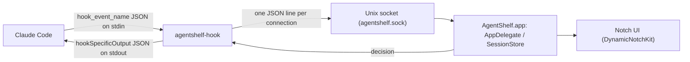

# AgentShelf


A macOS menu-bar app that surfaces your Claude Code sessions — approvals, status, and
activity — in the notch, so you don't have to keep switching back to the terminal.

AgentShelf sits above everything else on screen as a small pill in (or near) the notch.
It quietly tracks every Claude Code session you have running, expands to show what's
happening when it matters, and lets you approve or deny a tool call without ever leaving
whatever you're doing.

## Contents

- [Install](#install)
- [Features](#features)
- [How it works](#how-it-works)
- [Development](#development)
- [Testing](#testing)
- [Releasing (maintainers)](#releasing-maintainers)
- [Roadmap](#roadmap)

## Install

1. Download the latest DMG from [Releases](https://github.com/abmbodj/AgentShelf/releases/latest).
2. Open it and drag **AgentShelf.app** onto the **Applications** shortcut.
3. Launch AgentShelf from Spotlight (⌘Space → "AgentShelf") like any other app.
4. From the menu bar icon, install the Claude Code hooks so sessions actually show up.

Notarized releases open with no Gatekeeper warning. If a release isn't notarized yet (no
Developer ID cert configured), macOS will block it on first launch — right-click
**AgentShelf.app** → **Open** → **Open** to run it anyway.

AgentShelf itself checks for new releases on launch and shows an "Update available" item in
the menu bar when one exists — no auto-install, it just links you to the release page.

## Features

- **Live session pills in the notch.** Every running Claude Code session shows up as a
  row — folder name, agent type, elapsed time, and a friendly activity label ("Writing
  `middleware.ts`", "Running `swift test`") derived from its last tool call. Hover, click
  the pin, or wait for something that needs attention to expand the panel.

- **Inline approve/deny, with diffs.** A blocking permission request (a real yes/no tool
  grant) shows up as an approval card right in the notch — Allow, Deny, or Always Allow —
  without switching back to the terminal. Edit/MultiEdit/Write requests render a full
  before/after diff of the file, not just the raw tool arguments.

- **Non-binary prompts stay out of the way.** Things like `AskUserQuestion` or
  `ExitPlanMode` aren't a plain yes/no grant, so the notch never tries to answer them
  itself — it just surfaces a "needs input" notice and lets Claude's own prompt drive.

- **Subagent nesting.** Subagents (`explore`, `code-reviewer`, etc.) render directly under
  their parent session instead of as stray peer rows, and never trigger their own
  attention-grabbing flash.

- **"Working…" and "Done" feedback per session.** An animated ellipsis marks a session
  as actively working; when its turn completes, that row flashes "Done" with a checkmark
  and an approval sound — quiet if you're already looking at the editor/terminal it's in.

- **"Open in Claude" jump.** Click a session to focus the editor window for its folder —
  or, with Cursor Tab Targeting installed, jump to the exact integrated-terminal tab that
  session is running in, instead of just activating Cursor.

- **Usage tracking.** An optional statusline install wraps Claude Code's own `statusLine`
  and surfaces your 5-hour and 7-day rate-limit usage.

- **Sound + mute controls.** Pick from six system sounds for approval/attention alerts, or
  mute them entirely, from the menu bar.

- **Launch at login by default**, single-instance enforcement, and an automatic
  update check against GitHub Releases.

- **Self-diagnosing hooks.** "Check Hooks…" in the menu bar reports whether your Claude
  Code settings, the managed hook binary, and the app's socket are all healthy, with a
  one-click repair.

## How it works



- **`agentshelf-hook`** is registered as a Claude Code hook. It reads the raw hook payload
  on stdin, normalizes it into a small wire message (including building file diffs for
  Edit/MultiEdit/Write), and forwards it to the app over a Unix socket. For a blocking
  permission request, it waits on the app's decision and prints Claude's expected
  `hookSpecificOutput` reply on stdout — and *always* exits 0, since a hook timeout fails
  open back to Claude's own prompt.
- **The app** (`AgentShelfApp`) owns the socket server, an in-memory `SessionStore` of
  active sessions/approvals, and a `NotchController` that reconciles all of that into the
  notch's pill/expanded states.
- **A deadline chain protects against a hung app or hook**: the Claude Code settings entry
  timeout is the outermost bound, then the hook's own wait on the socket, then the app's
  wait on the user — each one shorter than the one around it, so every stage fails open
  rather than leaving Claude blocked indefinitely.
- **`agentshelf-setup`** is the same install/uninstall logic as the menu bar, exposed as a
  CLI (`agentshelf-setup install|uninstall|status`, and `agentshelf-setup statusline ...`)
  for scripting or debugging outside the app.

## Development

Requires Swift 6.2+ / Xcode 16+, macOS 14+.

```
swift build              # compile only, run with `swift run AgentShelfApp`
./scripts/dev.sh         # kill running instance, debug build, relaunch the bundled app
```

Use `scripts/dev.sh` (not `swift run`) when working on anything that depends on the app
being a real bundle — launch-at-login, single-instance enforcement, the app icon.

To drive the shelf without a live Claude Code session, replay canned hook messages
straight over the socket:

```
./scripts/replay.sh demo       # a session + a subagent show up on the shelf
./scripts/replay.sh approval   # sends a binary PermissionRequest — try Allow/Deny in the notch
./scripts/replay.sh end        # ends the replayed sessions
```

## Testing

```
swift test
```

`Tests/AgentShelfCoreTests` covers the install/uninstall logic for Claude Code hooks, the
statusline wrapper, and Cursor settings; permission classification (binary vs. non-binary
prompts); the file-diff builder; subagent nesting order; and jump-target resolution.

## Releasing (maintainers)

```
./scripts/release.sh 0.2.0
```

This stamps the version into `Info.plist`, builds and signs a release binary (with the best
identity available — Developer ID Application, else a free Apple Development cert, else
ad-hoc), builds the DMG, and publishes a GitHub Release with the DMG attached (via `gh`, if
installed).

If a "Developer ID Application" certificate is in your keychain, it also notarizes and
staples the build automatically — otherwise it's signed but unnotarized, and Gatekeeper will
block first launch until the user right-clicks → Open. To enable notarization, one-time per
machine:

```
xcrun notarytool store-credentials AgentShelf \
  --apple-id you@example.com --team-id TEAMID --password app-specific-password
```

(plus generating the Developer ID Application cert itself via Xcode → Settings → Accounts →
Manage Certificates, which requires an active paid Apple Developer Program membership).

## Roadmap

AgentShelf's session model already accounts for more than one coding agent
(`AgentSource`: `claudeCode`, `codex`, `geminiCLI`, `cursor`), with a `Capability` flag
distinguishing full approval flows from status-only monitoring. Today, **Claude Code is
the only fully-wired integration** — it's the only one with a real hook, installer, and
approval flow. Codex, Gemini CLI, and Cursor are modeled as monitor-only placeholders for
future support and don't yet report any sessions to the shelf.
